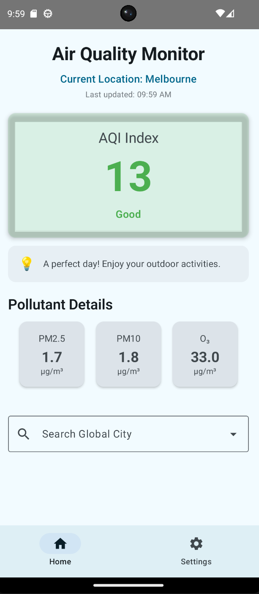
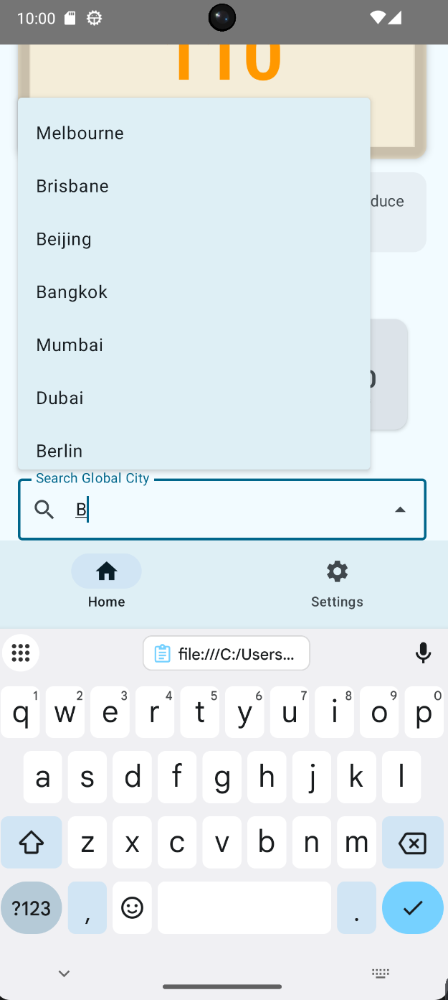
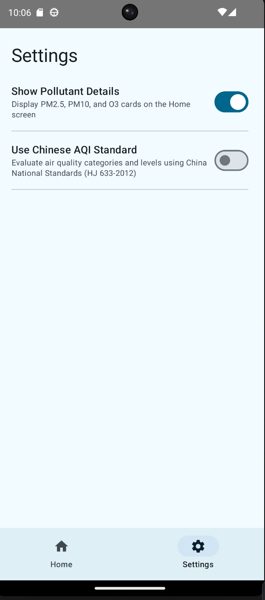

# Air Quality Monitor (AQI Utility App) 

A fast, intuitive, and feature-rich Android utility application designed to provide **at-a-glance** air quality information for global cities. This app was developed as Assignment 1 for CP3406 (Mobile Application Development) at James Cook University.

## Screenshots

  
  &nbsp;&nbsp;&nbsp;&nbsp;
  
  &nbsp;&nbsp;&nbsp;&nbsp;
  

*From left to right: Main Dashboard with actionable advice, Global City Search with autocomplete, and the Settings Screen controlling UI states.*

## App Purpose & Core Utility
The primary goal of this utility app is to deliver **immediate, actionable insights** regarding environmental health. It avoids unnecessary complexity by focusing purely on what the user needs to know right now: *Is the air safe to breathe?*

**Key Features:**
* **Real-time AQI Index:** Instantly displays the current Air Quality Index with dynamic color-coded severity levels (Good to Hazardous).
* **Actionable Health Advice:** Provides context-aware health recommendations based on the current pollution level.
* **Global City Search:** A searchable dropdown menu to quickly switch between over 25 major cities worldwide.
* **Pull-to-Refresh:** Supports native pull-down gestures to fetch the latest data, complete with a "Last updated" timestamp.
* **Customizable Settings:**
  * Toggle the display of detailed pollutants (PM2.5, PM10, O₃) to keep the home screen clean.
  * Switch between standard AQI calculations and the **Chinese National Standard (HJ 633-2012)** for localized reporting.

## Technical Architecture & API Usage
This application is built using modern Android development practices, demonstrating proficiency in the topics covered in Weeks 1-5:

* **UI Framework:** 100% **Jetpack Compose** following **Material Design 3** principles (Cards, Switches, ExposedDropdownMenuBox, PullToRefresh).
* **App Architecture:** Implements a robust **MVVM (Model-View-ViewModel)** architecture combined with the **Repository Pattern** to separate UI logic from data fetching.
* **Dependency Injection:** Utilizes **Koin** (`startKoin`, `koinViewModel()`) for efficient dependency management and ViewModel instantiation across multiple screens without prop drilling.
* **Networking:** Uses **Retrofit2** to consume external Web APIs asynchronously, with robust error handling and fallback mock data mechanisms.
* **State Management:** Leverages `LiveData` and Compose's `observeAsState()` for reactive UI updates across the Navigation graph.

## Project Structure

* `data/`
  * `api/` - Retrofit client and API interfaces.
  * `model/` - Data classes for JSON parsing (e.g., `AqiResponse`).
  * `repository/` - `AqiRepository` handling data abstraction.
* `di/` - Koin module (`appModule.kt`) for dependency injection setup.
* `presentation/viewmodel/` - `AqiViewModel` managing state and business logic.
* `screens/`
  * `UtilityScreen.kt` - The main dashboard for AQI display and city switching.
  * `SettingsScreen.kt` - User preferences controlling main screen behavior.

## Getting Started

1. Clone this repository to your local machine.
2. Open the project in **Android Studio (Giraffe or newer recommended)**.
3. Sync the Gradle files to download all necessary dependencies (Koin, Retrofit, Compose).
4. Run the app on an emulator or a physical Android device.

*Note: Ensure you have an active internet connection to fetch live AQI data.*